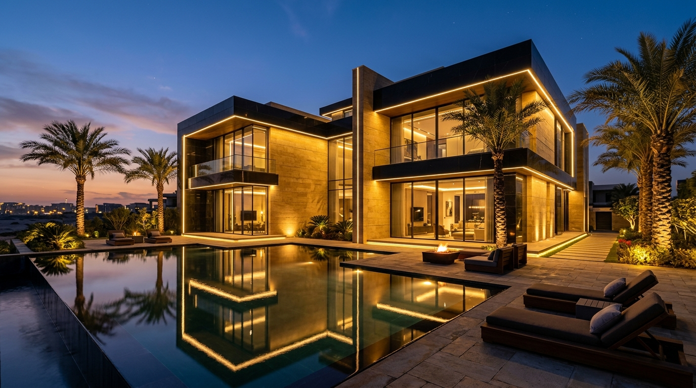

<div align="center">

# 🏛️ عقاري | AQARI AI
### **المنصة الذكية الأولى لتقييم العقارات في مصر بالذكاء الاصطناعي**
### *Ultra-Luxury AI Real Estate Valuation & Market Intelligence Platform*

[](https://fastapi.tiangolo.com)
[](https://python.org)
[](https://scikit-learn.org)
[](https://lightgbm.readthedocs.io)
[](https://opensource.org/licenses/MIT)

<br>



<br><br>

[🌐 **تجربة الموقع لايف أونلاين (Live Web Demo)**](https://media-syndicate-scuba-distributed.trycloudflare.com) • [📖 **التوثيق التفاعلي للـ API (Swagger UI)**](https://media-syndicate-scuba-distributed.trycloudflare.com/docs) • [📓 **ملف النوت بوك الكامل (Jupyter Notebook)**](Egyptian_House_Price_Predictor.ipynb)

</div>

---

## 🌟 نظرة عامة عن المشروع (Overview)

**عقاري (AQARI AI)** هو تطبيق ويب متكامل (**Full-Stack Machine Learning**) مصمم بأرقى معايير التصميم العالمي باللونين **الأسود والذهبي الملكي (Black & Gold)**، ومبني لخدمة السوق العقاري المصري 🇪🇬.

تم تدريب نماذج الذكاء الاصطناعي على أكثر من **14,000 عقار حقيقي** في أرقى مدن ومحافظات مصر (القاهرة الجديدة، الشيخ زايد، 6 أكتوبر، الساحل الشمالي، رأس الحكمة، الجونة، المعادي، وغيرها).

---

## ✨ المميزات الرئيسية للمشروع (Key Features)

### 1. 🏢 تقسيم المساحة إلى 3 فئات ذكية (Size Tiers):
- **مساحة صغيرة (40 - 120 م²):** شقق ستوديو وغرفة وغرفتين مع سلايدر مخصص وأزرار سريعة.
- **مساحة متوسطة (120 - 250 م²):** شقق عائلية ودوبلكس 3 غرف (الأكثر طلباً).
- **مساحة كبيرة (250 - 800 م²):** فيلات مستقلة فاخرة وتاون هاوس وبنتهاوس.

### 2. 👑 كروت المميزات والإطلالات الفاخرة (Luxury Amenities):
حساب الأثر المالي الفوري لكل ميزة:
- 🌊 **إطلالة مباشرة على البحر / بحيرة:** (+28% علاوة سوقية).
- ⛱️ **روف خاص (Private Roof):** (+7% مساحة خارجية).
- 🏊 **حمام سباحة خاص:** (+24% رفاهية واستجمام).
- 🌳 **حديقة خاصة (Private Garden):** (+18% مساحة خضراء).
- ✨ **تشطيب ألترا سوبر لوكس:** (+15% جاهز للسكن).
- 🛋️ **مفروش بالكامل بأرقى أثاث:** (+12% أثاث وتجهيزات).
- 👩‍💼 **غرفة خادمة خاصة بحمام:** (+9% خصوصية عائلية).

### 3. 💳 حاسبة خطة التقسيط الميسرة (Installment Calculator):
- حساب فوري للمقدم (10%، 15%، 20%، 25%، 30%) بالجنيه.
- توزيع الأقساط على (3، 5، 7، 8، 10 سنوات).
- حساب **القسط الشهري**، و**القسط الربع سنوي**، والمبلغ المتبقي بدقة متناهية.

### 4. 🌐 دعم كامل للغتين (Bilingual AR / EN):
- زر تبديل فوري في أعلى الشاشة يحول المنصة بالكامل بين **العربية (RTL)** و **الإنجليزية (LTR)**.

---

## 🧠 مقارنة نماذج الذكاء الاصطناعي (Machine Learning Benchmark)

تم تدريب واختبار 4 نماذج مع تطبيق **Target Log Transformation** و **ColumnTransformer Pipeline**:

| الترتيب | النموذج (Model) | معامل التحديد ($R^2$ Score) | متوسط الخطأ (MAE) | التقييم الهندسي |
|:---:|:---|:---:|:---:|:---|
| 🥇 | **LightGBM Regressor** | **0.6124** | **2,777,060 EGP** | **الفائز بالمركز الأول** — فائق السرعة وتفوق في التعامل مع الفئات النصية |
| 🥈 | **Random Forest** | **0.6075** | 2,855,339 EGP | قوي جداً في العلاقات غير الخطية |
| 🥉 | **XGBoost Regressor** | **0.5764** | 2,917,614 EGP | ممتاز لكنه حساس للقيم الشاذة القصوى |
| 4 | **Linear Regression** | **0.5059** | 3,175,726 EGP | النموذج المرجعي الأساسي (Baseline) |

---

## 🗂️ هيكل المشروع (Project Architecture)

```
aqari-ai/
├── app/
│   ├── main.py               # سيرفر FastAPI ومسارات الـ API
│   ├── predictor.py          # منطق التنبؤ وحساب الأقساط والمميزات
│   ├── schemas.py            # نماذج Pydantic للتحقق من البيانات
│   ├── models/
│   │   ├── best_model.pkl    # الموديل الفائز المدرب (LightGBM Pipeline)
│   │   └── model_metrics.json # إحصائيات المقارنة وخيارات المدن والكومباوندات
│   └── static/               # واجهة المستخدم الفاخرة
│       ├── index.html        # هيكل الصفحة باللغتين العربية والإنجليزية
│       ├── styles.css        # تصميم ملكي Black & Gold بتأثيرات Glassmorphism
│       ├── app.js            # التفاعلية وحاسبة الأقساط ورسوم Chart.js
│       └── hero.jpg          # صورة الغلاف المعمارية عالية الدقة
├── notebooks/
│   └── Egyptian_House_Price_Predictor.ipynb  # النوت بوك الشامل بكافة الرسومات
├── Egyptian_House_Price_Predictor.ipynb      # نوت بوك للعرض المباشر على GitHub
├── requirements.txt          # مكتبات بايثون المطلوبة
├── Dockerfile                # ملف النشر السحابي (Docker Container)
└── README.md                 # دليل التوثيق التعريفي
```

---

## 🚀 التشغيل محلياً (Run Locally)

```bash
# 1. استنساخ المستودع
git clone https://github.com/khuloodkhalid05-del/aqari-ai.git
cd aqari-ai

# 2. تثبيت الحزم المطلوبة
pip install -r requirements.txt

# 3. تشغيل السيرفر
uvicorn app.main:app --reload --port 8000
```

افتح المتصفح على الرابط: **`http://127.0.0.1:8000`** 🏠

---

## 📡 واجهة برمجة التطبيقات (API Endpoints)

- **`POST /api/predict`** ⬅️ تقدير سعر العقار بناءً على المساحة والمميزات والموقع.
- **`GET /api/models`** ⬅️ تفاصيل دقة النماذج الأربعة ومقارنتها.
- **`GET /api/stats`** ⬅️ إحصائيات السوق وقائمة المدن والكومباوندات.
- **`GET /docs`** ⬅️ توثيق تفاعلي كامل عبر **Swagger UI**.

---

<div align="center">

Developed with ❤️ for the Egyptian Real Estate Market 🇪🇬

</div>
